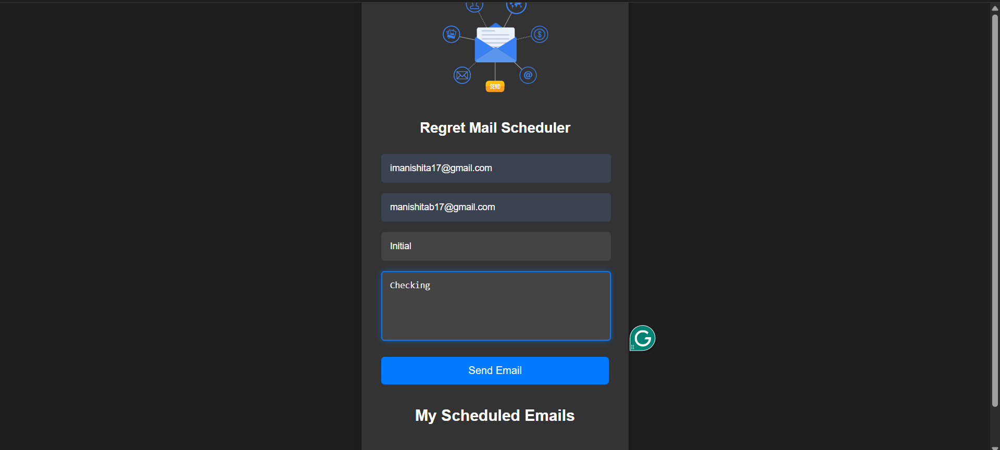

# Regret Mail Scheduler

Designed and deployed a full-stack web application **Regret Mail Scheduler** enabling users to edit or cancel scheduled emails
within 10 minutes after sending.

---

## 🔧 Tech Stack

### Frontend
- [React (Vite)](https://vitejs.dev/)
- CSS

### Backend
-  [Spring Boot](https://spring.io/projects/spring-boot)

---

## Features

-Engineered RESTful APIs in Spring Boot with robust CRUD operations and error handling to improve
system reliability.
-Integrated Lottie animations to enhance user experience and improve visual feedback.

---

##UI Preview




---

##  Getting Started

### Frontend

```bash
# Clone the repository
git clone https://github.com/yourusername/regret-mail-scheduler.git
cd regret-mail-scheduler

# Install frontend dependencies
npm install

# Run the frontend (Vite dev server)
npm run dev
